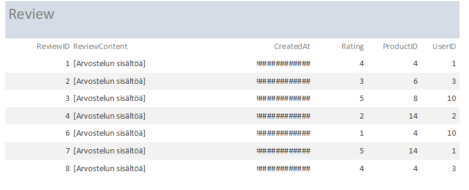

Loppuraportti - TTZC0800
========================

Gameplanet
----------

-   Leevi Kopakkala - K8292 \| K8292\@student.jamk.fi

-   Aku Lehtonen - K9264 \| <K9264@student.jamk.fi>

Arvosana ehdotukset:

-   Leevi Kopakkala 55/60

-   Aku Lehtonen 55/60

    Vaikka ratkaisu ei välttämättä ole täydellinen, pääsimme molemmat haastamaan
    itsemme ja kokeilemaan jotain täysin uutta.

Aloitus
-------

Aloitimme suunnittelun perinteisesti whiteboardilla, koska se tuntui
luntevimmalta, sekä nopeimmalta tavalta tehdä käsitemallinnusta ja löytää
oikeasti niitä asioita, mitä tietokannassa tarvitsemme.

Lähtökohtana oli luoda jonkinlainen kauppajärjestelmä (alunperin idea lähti
siitä pitsa paikasta), eli paikka jossa voisi myydä jotain tuotetta. Mutta
ajattelimme, että suurinosa loisi tällaisen ratkaisun, halusimme luoda jotain
täysin uutta.

Eli kyseessä on pelikauppa, jossa fyysisten esineiden sijaan myisimme lisenssejä
peleihin, joihin käyttäjät voisivat ostaa oikeudet pelata. (Eli pelin sijaan ei
omistaisi itse peliä vaan oikeuden pelata peliä)

Harva pelikauppa nykyisin on täysin pelkkä pelikauppa, joten loimme yhteisö
ominaisuuksia sen ympärille. Eli mahdollisuuden luoda profiileja, kommunikoida
toisten kanssa yms.

Yhteenveto projektista:
-----------------------

Teimme käytännössä kaiken tasavertaisesti, jaoimme työtehtävä ja aloimme
työstämään projektia Githubissa.

Ongelmakohtia ei oikeastaan tullut, suunnittelimme alkuun todella huolellisesti
tietokannan rakenteen, joka loppujenlopuksi oikeasti oli toimiva ratkaisua ja
suuremmilta ongelmilta vältyttiin.

Eli juuri tuo mitä me taululla piirtelimme oikeasti oli todella lähellä
lopputulosta.  
Siinä pääsimme keskustelemaan ratkaisusta, tekemään nopeita muutoksia ja pala
palalta rakentamaan lopputulosta.

Alkuvaiheessa kun suunnittelimme ja mietimme ratkaisun pitkälle, työntekeminen
oli todella tehokasta kun ei todellakaan tullut juuri minkäänlaisia ongelmia

Kun suunnitelma oli valmis, sekä olimme kirjoittaneet Githubiin työnjakoon ja
itse suunnitelmaan liittyvät dokumenit, meillä oli todella helppo lähteä luomaan
tietokantaratkaisua yhdessä Workbenchillä, jossa saimme nähdä mitä saatamme
tarvita, sekä koko tietokannan rakenne tuli selkeämmäksi.

Mutta kuten näkyy, lopullinen ratkaisu on todella lähellä sitä alkuperäistä
suunnitelmaa.

Ja vaikka tietokannassa on suhteellisen monimutkainen rakenne, tiesimme
tarkalleen miten sen pitäisi toimia ja lopputulos: Se toimi kuten ajattelimme!

Tässä testasimme omia kykyjämme, sekä parityö taitoja. Loimme ratkaisun, jota ei
lähelläkään ole harjoitustehtävissä tai osaamistesteissä tullut vastaan.

Käyttöliittymä:
---------------

### Mietteet käyttöliittymästä

Koska Access on hieman rajallisempi prototyypin teko väline, loimme
käyttöliittymän jolla voi käyttää yksinkertaisimpia toimintoja, sekä hakemaan
kaiken tarvittavan tiedon.

### Login

`Kirjautumisruutu`

`Jos kirjautumistunnukset väärä`

`Kun kirjautumistunnukset oikeat`

Login ruutua varten piti kirjoittaa hieman VB koodia, jotta se oikeasti toimisi:

~~~~~~~~~~~~~~~~~~~~~~~~~~~~~~~~~~~~~~~~~~~~~~~~~~~~~~~~~~~~~~~~~~~~~~~~~~~~~~~~
Option Compare Database

Private Sub Command1_Click()
Dim User As String
Dim TempPass As String
Dim ID As Integer
Dim UserName As String
Dim TempID As String

If IsNull(Me.txtUsername) Then
 MsgBox "Please enter Username", vbInformation, "Username required"
 Me.txtUsername.SetFocus
ElseIf IsNull(Me.txtPassword) Then
 MsgBox "Please enter Password", vbInformation, "Password required"
 Me.txtPassword.SetFocus
Else
 If (IsNull(DLookup("UserName", "User", "UserName = '" & Me.txtUsername.Value & "' And Password = '" & Me.txtPassword.Value & "'"))) Then
 MsgBox "Invalid Username or Password!"
 Else
 UserName = DLookup("[Username]", "User", "[UserName] = '" & Me.txtUsername.Value & "'")
 TempPass = DLookup("[Password]", "User", "[UserName] = '" & Me.txtUsername.Value & "'")
 DoCmd.OpenForm "Profile Subform", , , "UserName = '" & Me!txtUsername & "'"

 End If
 End If
End Sub

Private Sub Form_Load()
Me.txtUsername.SetFocus
End Sub 
~~~~~~~~~~~~~~~~~~~~~~~~~~~~~~~~~~~~~~~~~~~~~~~~~~~~~~~~~~~~~~~~~~~~~~~~~~~~~~~~

~~~~~~~~~~~~~~~~~~~~~~~~~~~~~~~~~~~~~~~~~~~~~~~~~~~~~~~~~~~~~~~~~~~~~~~~~~~~~~~~

~~~~~~~~~~~~~~~~~~~~~~~~~~~~~~~~~~~~~~~~~~~~~~~~~~~~~~~~~~~~~~~~~~~~~~~~~~~~~~~~

~~~~~~~~~~~~~~~~~~~~~~~~~~~~~~~~~~~~~~~~~~~~~~~~~~~~~~~~~~~~~~~~~~~~~~~~~~~~~~~~

~~~~~~~~~~~~~~~~~~~~~~~~~~~~~~~~~~~~~~~~~~~~~~~~~~~~~~~~~~~~~~~~~~~~~~~~~~~~~~~~

~~~~~~~~~~~~~~~~~~~~~~~~~~~~~~~~~~~~~~~~~~~~~~~~~~~~~~~~~~~~~~~~~~~~~~~~~~~~~~~~

~~~~~~~~~~~~~~~~~~~~~~~~~~~~~~~~~~~~~~~~~~~~~~~~~~~~~~~~~~~~~~~~~~~~~~~~~~~~~~~~

~~~~~~~~~~~~~~~~~~~~~~~~~~~~~~~~~~~~~~~~~~~~~~~~~~~~~~~~~~~~~~~~~~~~~~~~~~~~~~~~

~~~~~~~~~~~~~~~~~~~~~~~~~~~~~~~~~~~~~~~~~~~~~~~~~~~~~~~~~~~~~~~~~~~~~~~~~~~~~~~~

~~~~~~~~~~~~~~~~~~~~~~~~~~~~~~~~~~~~~~~~~~~~~~~~~~~~~~~~~~~~~~~~~~~~~~~~~~~~~~~~

~~~~~~~~~~~~~~~~~~~~~~~~~~~~~~~~~~~~~~~~~~~~~~~~~~~~~~~~~~~~~~~~~~~~~~~~~~~~~~~~

~~~~~~~~~~~~~~~~~~~~~~~~~~~~~~~~~~~~~~~~~~~~~~~~~~~~~~~~~~~~~~~~~~~~~~~~~~~~~~~~

~~~~~~~~~~~~~~~~~~~~~~~~~~~~~~~~~~~~~~~~~~~~~~~~~~~~~~~~~~~~~~~~~~~~~~~~~~~~~~~~

~~~~~~~~~~~~~~~~~~~~~~~~~~~~~~~~~~~~~~~~~~~~~~~~~~~~~~~~~~~~~~~~~~~~~~~~~~~~~~~~

~~~~~~~~~~~~~~~~~~~~~~~~~~~~~~~~~~~~~~~~~~~~~~~~~~~~~~~~~~~~~~~~~~~~~~~~~~~~~~~~

### Create User

Eli tällä voi oikeasti luoda käyttäjän. Kirjoittaa tiedot ja painaa nappia, niin
tiedot siirtyvät koodin mukaisesti tietokantaan!

~~~~~~~~~~~~~~~~~~~~~~~~~~~~~~~~~~~~~~~~~~~~~~~~~~~~~~~~~~~~~~~~~~~~~~~~~~~~~~~~
Option Compare Database

Private Sub Command11_Click()

Dim db As Database
Dim rec As Recordset

Set db = CurrentDb
Set rec = db.OpenRecordset("Select * from User")

rec.AddNew
rec("FirstName") = Me.txtFirstName
rec("LastName") = Me.txtLastname
rec("UserName") = Me.txtUsername
rec("Email") = Me.txtEmail
rec("Password") = Me.txtPassword
rec.Update

Set rec = Nothing
Set db = Nothing
End Sub
~~~~~~~~~~~~~~~~~~~~~~~~~~~~~~~~~~~~~~~~~~~~~~~~~~~~~~~~~~~~~~~~~~~~~~~~~~~~~~~~

~~~~~~~~~~~~~~~~~~~~~~~~~~~~~~~~~~~~~~~~~~~~~~~~~~~~~~~~~~~~~~~~~~~~~~~~~~~~~~~~

~~~~~~~~~~~~~~~~~~~~~~~~~~~~~~~~~~~~~~~~~~~~~~~~~~~~~~~~~~~~~~~~~~~~~~~~~~~~~~~~

### Show games

Show games nappia painamalla pääsee näkemään omistamansa pelit, eli se hakee
ID:n mukaan kaikki pelit joidenka lisenssin omistat

### Store

Storesssa pääsee näkemään kaupan sisällön

Raportit:
---------

