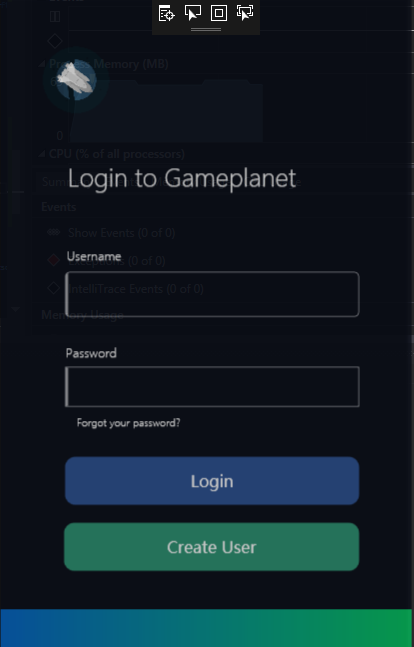

Loppuraportti - TTOS0300
========================

Gameplanet
----------

-   Leevi Kopakkala - K8292 \| <K8292\@student.jamk.fi>

-   Aku Lehtonen - K9264 \| <K9264@student.jamk.fi>


Aloitus
-------

Aloitimme suunnittelun perinteisesti whiteboardilla, koska se tuntui
luntevimmalta, sekä nopeimmalta tavalta tehdä käsitemallinnusta ja löytää
oikeasti niitä asioita, mitä tietokannassa tarvitsemme.

Lähtökohtana oli luoda jonkinlainen kauppajärjestelmä (alunperin idea lähti
siitä pitsa paikasta), eli paikka jossa voisi myydä jotain tuotetta. Mutta
ajattelimme, että suurinosa loisi tällaisen ratkaisun, halusimme luoda jotain
täysin uutta.

Eli kyseessä on pelikauppa, jossa fyysisten esineiden sijaan myisimme lisenssejä
peleihin, joihin käyttäjät voisivat ostaa oikeudet pelata. (Eli pelin sijaan ei
omistaisi itse peliä vaan oikeuden pelata peliä)

Harva pelikauppa nykyisin on täysin pelkkä pelikauppa, joten loimme yhteisö
ominaisuuksia sen ympärille. Eli mahdollisuuden luoda profiileja, kommunikoida
toisten kanssa yms.

Yhteenveto projektista:
-----------------------

Teimme käytännössä kaiken tasavertaisesti, jaoimme työtehtävä ja aloimme
työstämään projektia Githubissa.

Ongelmakohtia ei oikeastaan tullut, suunnittelimme alkuun todella huolellisesti
tietokannan rakenteen, joka loppujenlopuksi oikeasti oli toimiva ratkaisua ja
suuremmilta ongelmilta vältyttiin.

Eli juuri tuo mitä me taululla piirtelimme oikeasti oli todella lähellä
lopputulosta.  
Siinä pääsimme keskustelemaan ratkaisusta, tekemään nopeita muutoksia ja pala
palalta rakentamaan lopputulosta.

Alkuvaiheessa kun suunnittelimme ja mietimme ratkaisun pitkälle, työntekeminen
oli todella tehokasta kun ei todellakaan tullut juuri minkäänlaisia ongelmia


Kun suunnitelma oli valmis, sekä olimme kirjoittaneet Githubiin työnjakoon ja
itse suunnitelmaan liittyvät dokumenit, meillä oli todella helppo lähteä luomaan
tietokantaratkaisua yhdessä Workbenchillä, jossa saimme nähdä mitä saatamme
tarvita, sekä koko tietokannan rakenne tuli selkeämmäksi.

Mutta kuten näkyy, lopullinen ratkaisu on todella lähellä sitä alkuperäistä
suunnitelmaa.

Ja vaikka tietokannassa on suhteellisen monimutkainen rakenne, tiesimme
tarkalleen miten sen pitäisi toimia ja lopputulos: Se toimi kuten ajattelimme!

Tässä testasimme omia kykyjämme, sekä parityö taitoja. Loimme ratkaisun, jota ei
lähelläkään ole harjoitustehtävissä tai osaamistesteissä tullut vastaan.

# Sovellus: 

## 1. Asennus


Pitää varmistaa, että on yhteydessä Labranettiin. (Joko VPN yli, tai suoraan verkossa) 
Jotta tietokanta yhteys toimii


## 2. Tietoa ohjelmasta (mitä tekee, miksi etc)

Ohjelma on 

### Toiminalliset vaatimukset

* Kirjaudu sisään
* Selaa kauppaa
* Selaa profiilia
* Kommentoi profiilia
* Luo käyttäjä
* Osta peli

### Ei-toiminnalliset vaatimukset

* Käyttöliittymä on selkeä
* Käyttöliittymä on Englanniksi
* Sovellus saa yhteyden tietokantaan


listaa toteutetut toiminnalliset vaatimukset
listaa toteuttamatta jääneet toiminnalliset vaatimukset
listaa toiminnallisuus joka toteuttiin ohi/yli alkuperäisten vaatimusten
listaa ei-toiminnalliset vaatimukset sekä mahdolliset reunaehdot/rajoitukset


## 3. Kuvaruutukaappaukset tärkeimmistä käyttöliittymistä + lyhyet käyttöohjeet jollei "ilmiselvää"




## 4. Ohjelman tarvitsemat /mukana tulevat tiedostot/tietokannat


kuvaukset tietokannoista ml. tietokanta-kaavio
laita tarvittaessa mukaan tietokannan luontiskriptit ja testidatan lisäysskriptit

Luonti:

```SQL
-- MySQL Workbench Forward Engineering

SET @OLD_UNIQUE_CHECKS=@@UNIQUE_CHECKS, UNIQUE_CHECKS=0;
SET @OLD_FOREIGN_KEY_CHECKS=@@FOREIGN_KEY_CHECKS, FOREIGN_KEY_CHECKS=0;
SET @OLD_SQL_MODE=@@SQL_MODE, SQL_MODE='TRADITIONAL,ALLOW_INVALID_DATES';

-- -----------------------------------------------------
-- Schema mydb
-- -----------------------------------------------------
-- -----------------------------------------------------
-- Schema K8292_2
-- -----------------------------------------------------

-- -----------------------------------------------------
-- Schema K8292_2
-- -----------------------------------------------------
CREATE SCHEMA IF NOT EXISTS `K8292_2` DEFAULT CHARACTER SET utf8 ;
USE `K8292_2` ;

-- -----------------------------------------------------
-- Table `K8292_2`.`Campaign`
-- -----------------------------------------------------
CREATE TABLE IF NOT EXISTS `K8292_2`.`Campaign` (
  `CampaignID` INT(11) NOT NULL AUTO_INCREMENT,
  `CampaignCode` VARCHAR(45) NOT NULL,
  `StartsAt` DATETIME NOT NULL,
  `EndsAt` DATETIME NOT NULL,
  PRIMARY KEY (`CampaignID`))
ENGINE = InnoDB
AUTO_INCREMENT = 7
DEFAULT CHARACTER SET = utf8;


-- -----------------------------------------------------
-- Table `K8292_2`.`Product`
-- -----------------------------------------------------
CREATE TABLE IF NOT EXISTS `K8292_2`.`Product` (
  `ProductID` INT(11) NOT NULL AUTO_INCREMENT,
  `Name` VARCHAR(45) NOT NULL,
  `Description` TEXT NOT NULL,
  `Price` DOUBLE(6,2) NOT NULL,
  PRIMARY KEY (`ProductID`))
ENGINE = InnoDB
AUTO_INCREMENT = 15
DEFAULT CHARACTER SET = utf8;


-- -----------------------------------------------------
-- Table `K8292_2`.`Campaign_has_Product`
-- -----------------------------------------------------
CREATE TABLE IF NOT EXISTS `K8292_2`.`Campaign_has_Product` (
  `CampaignID` INT(11) NOT NULL,
  `ProductID` INT(11) NOT NULL,
  PRIMARY KEY (`CampaignID`, `ProductID`),
  INDEX `fk_Campaign_has_Product_Product1_idx` (`ProductID` ASC),
  INDEX `fk_Campaign_has_Product_Campaign1_idx` (`CampaignID` ASC),
  CONSTRAINT `fk_Campaign_has_Product_Campaign1`
    FOREIGN KEY (`CampaignID`)
    REFERENCES `K8292_2`.`Campaign` (`CampaignID`)
    ON DELETE NO ACTION
    ON UPDATE NO ACTION,
  CONSTRAINT `fk_Campaign_has_Product_Product1`
    FOREIGN KEY (`ProductID`)
    REFERENCES `K8292_2`.`Product` (`ProductID`)
    ON DELETE NO ACTION
    ON UPDATE NO ACTION)
ENGINE = InnoDB
DEFAULT CHARACTER SET = utf8;


-- -----------------------------------------------------
-- Table `K8292_2`.`Category`
-- -----------------------------------------------------
CREATE TABLE IF NOT EXISTS `K8292_2`.`Category` (
  `CategoryID` INT(11) NOT NULL AUTO_INCREMENT,
  `CategoryName` VARCHAR(45) NULL DEFAULT NULL,
  `CategoryDesc` VARCHAR(45) NULL DEFAULT NULL,
  PRIMARY KEY (`CategoryID`))
ENGINE = InnoDB
AUTO_INCREMENT = 12
DEFAULT CHARACTER SET = utf8;


-- -----------------------------------------------------
-- Table `K8292_2`.`User`
-- -----------------------------------------------------
CREATE TABLE IF NOT EXISTS `K8292_2`.`User` (
  `UserID` INT(11) NOT NULL AUTO_INCREMENT,
  `FirstName` VARCHAR(45) NOT NULL,
  `LastName` VARCHAR(45) NOT NULL,
  `UserName` VARCHAR(45) NULL DEFAULT NULL,
  `Email` VARCHAR(45) NOT NULL,
  `Password` VARCHAR(45) NOT NULL,
  `CreatedAt` DATETIME NOT NULL,
  PRIMARY KEY (`UserID`),
  UNIQUE INDEX `Email` (`Email` ASC))
ENGINE = InnoDB
AUTO_INCREMENT = 14
DEFAULT CHARACTER SET = utf8;


-- -----------------------------------------------------
-- Table `K8292_2`.`Profile`
-- -----------------------------------------------------
CREATE TABLE IF NOT EXISTS `K8292_2`.`Profile` (
  `ProfileID` INT(11) NOT NULL AUTO_INCREMENT,
  `AvatarIMG` VARCHAR(45) NULL DEFAULT NULL,
  `ProfileDesc` VARCHAR(45) NULL DEFAULT NULL,
  `UserID` INT(11) NOT NULL,
  PRIMARY KEY (`ProfileID`),
  INDEX `fk_Profile_User_idx` (`UserID` ASC),
  CONSTRAINT `fk_Profile_User`
    FOREIGN KEY (`UserID`)
    REFERENCES `K8292_2`.`User` (`UserID`)
    ON DELETE NO ACTION
    ON UPDATE NO ACTION)
ENGINE = InnoDB
AUTO_INCREMENT = 10
DEFAULT CHARACTER SET = utf8;


-- -----------------------------------------------------
-- Table `K8292_2`.`Comment`
-- -----------------------------------------------------
CREATE TABLE IF NOT EXISTS `K8292_2`.`Comment` (
  `CommentID` INT(11) NOT NULL AUTO_INCREMENT,
  `CommentTXT` VARCHAR(45) NOT NULL,
  `CreatedAt` DATETIME NOT NULL,
  `ProfileID` INT(11) NOT NULL,
  `fk_CommentID` INT(11) NULL DEFAULT NULL,
  PRIMARY KEY (`CommentID`),
  INDEX `fk_Comment_Profile1_idx` (`ProfileID` ASC),
  INDEX `FK_CommentID_idx` (`fk_CommentID` ASC),
  CONSTRAINT `FK_CommentID`
    FOREIGN KEY (`fk_CommentID`)
    REFERENCES `K8292_2`.`Comment` (`CommentID`)
    ON DELETE NO ACTION
    ON UPDATE NO ACTION,
  CONSTRAINT `fk_Comment_Profile1`
    FOREIGN KEY (`ProfileID`)
    REFERENCES `K8292_2`.`Profile` (`ProfileID`)
    ON DELETE NO ACTION
    ON UPDATE NO ACTION)
ENGINE = InnoDB
AUTO_INCREMENT = 15
DEFAULT CHARACTER SET = utf8;


-- -----------------------------------------------------
-- Table `K8292_2`.`License`
-- -----------------------------------------------------
CREATE TABLE IF NOT EXISTS `K8292_2`.`License` (
  `LicenseID` INT(11) NOT NULL AUTO_INCREMENT,
  `LicenseKey` VARCHAR(45) NOT NULL DEFAULT '',
  `ProductID` INT(11) NOT NULL,
  `UserID` INT(11) NOT NULL,
  PRIMARY KEY (`LicenseID`),
  INDEX `fk_Licenses_Product1_idx` (`ProductID` ASC),
  INDEX `fk_Licenses_User1_idx` (`UserID` ASC),
  CONSTRAINT `fk_Licenses_Product1`
    FOREIGN KEY (`ProductID`)
    REFERENCES `K8292_2`.`Product` (`ProductID`)
    ON DELETE NO ACTION
    ON UPDATE NO ACTION,
  CONSTRAINT `fk_Licenses_User1`
    FOREIGN KEY (`UserID`)
    REFERENCES `K8292_2`.`User` (`UserID`)
    ON DELETE NO ACTION
    ON UPDATE NO ACTION)
ENGINE = InnoDB
AUTO_INCREMENT = 25
DEFAULT CHARACTER SET = utf8;


-- -----------------------------------------------------
-- Table `K8292_2`.`Payment`
-- -----------------------------------------------------
CREATE TABLE IF NOT EXISTS `K8292_2`.`Payment` (
  `PaymentID` INT(11) NOT NULL AUTO_INCREMENT,
  `PaymentType` VARCHAR(45) NOT NULL,
  PRIMARY KEY (`PaymentID`))
ENGINE = InnoDB
AUTO_INCREMENT = 14
DEFAULT CHARACTER SET = utf8;


-- -----------------------------------------------------
-- Table `K8292_2`.`PrdOrder`
-- -----------------------------------------------------
CREATE TABLE IF NOT EXISTS `K8292_2`.`PrdOrder` (
  `OrderID` INT(11) NOT NULL AUTO_INCREMENT,
  `TotalPrice` DOUBLE NOT NULL,
  `Status` ENUM('pending', 'processing', 'completed') NOT NULL,
  `UserID` INT(11) NOT NULL,
  `PaymentID` INT(11) NOT NULL,
  `CreatedAt` DATETIME NOT NULL,
  PRIMARY KEY (`OrderID`),
  INDEX `fk_Order_User1_idx` (`UserID` ASC),
  INDEX `fk_Order_Payment1_idx` (`PaymentID` ASC),
  CONSTRAINT `fk_Order_Payment1`
    FOREIGN KEY (`PaymentID`)
    REFERENCES `K8292_2`.`Payment` (`PaymentID`)
    ON DELETE NO ACTION
    ON UPDATE NO ACTION,
  CONSTRAINT `fk_Order_User1`
    FOREIGN KEY (`UserID`)
    REFERENCES `K8292_2`.`User` (`UserID`)
    ON DELETE NO ACTION
    ON UPDATE NO ACTION)
ENGINE = InnoDB
AUTO_INCREMENT = 6
DEFAULT CHARACTER SET = utf8;


-- -----------------------------------------------------
-- Table `K8292_2`.`PrdOrder_has_License`
-- -----------------------------------------------------
CREATE TABLE IF NOT EXISTS `K8292_2`.`PrdOrder_has_License` (
  `OrderID` INT(11) NOT NULL,
  `LicenseID` INT(11) NOT NULL,
  PRIMARY KEY (`OrderID`, `LicenseID`),
  INDEX `fk_Order_has_Licenses_Licenses1_idx` (`LicenseID` ASC),
  INDEX `fk_Order_has_Licenses_Order1_idx` (`OrderID` ASC),
  CONSTRAINT `fk_Order_has_Licenses_Licenses1`
    FOREIGN KEY (`LicenseID`)
    REFERENCES `K8292_2`.`License` (`LicenseID`)
    ON DELETE NO ACTION
    ON UPDATE NO ACTION,
  CONSTRAINT `fk_Order_has_Licenses_Order1`
    FOREIGN KEY (`OrderID`)
    REFERENCES `K8292_2`.`PrdOrder` (`OrderID`)
    ON DELETE NO ACTION
    ON UPDATE NO ACTION)
ENGINE = InnoDB
DEFAULT CHARACTER SET = utf8;


-- -----------------------------------------------------
-- Table `K8292_2`.`Product_has_Category`
-- -----------------------------------------------------
CREATE TABLE IF NOT EXISTS `K8292_2`.`Product_has_Category` (
  `ProductID` INT(11) NOT NULL DEFAULT '0',
  `CategoryID` INT(11) NOT NULL DEFAULT '0',
  PRIMARY KEY (`ProductID`, `CategoryID`),
  INDEX `fk_Product_has_Category_Category1_idx` (`CategoryID` ASC),
  INDEX `fk_Product_has_Category_Product1_idx` (`ProductID` ASC),
  CONSTRAINT `fk_Product_has_Category_Product1`
    FOREIGN KEY (`ProductID`)
    REFERENCES `K8292_2`.`Product` (`ProductID`)
    ON DELETE NO ACTION
    ON UPDATE NO ACTION,
  CONSTRAINT `fk_Product_has_Category_Category1`
    FOREIGN KEY (`CategoryID`)
    REFERENCES `K8292_2`.`Category` (`CategoryID`)
    ON DELETE NO ACTION
    ON UPDATE NO ACTION)
ENGINE = InnoDB
DEFAULT CHARACTER SET = utf8;


-- -----------------------------------------------------
-- Table `K8292_2`.`Review`
-- -----------------------------------------------------
CREATE TABLE IF NOT EXISTS `K8292_2`.`Review` (
  `ReviewID` INT(11) NOT NULL AUTO_INCREMENT,
  `ReviewContent` VARCHAR(45) NOT NULL,
  `CreatedAt` DATETIME NOT NULL,
  `Rating` INT(11) UNSIGNED NOT NULL,
  `ProductID` INT(11) NOT NULL,
  `UserID` INT(11) NOT NULL,
  PRIMARY KEY (`ReviewID`),
  INDEX `fk_Review_Product1_idx` (`ProductID` ASC),
  INDEX `fk_Review_User1_idx` (`UserID` ASC),
  CONSTRAINT `fk_Review_Product1`
    FOREIGN KEY (`ProductID`)
    REFERENCES `K8292_2`.`Product` (`ProductID`)
    ON DELETE NO ACTION
    ON UPDATE NO ACTION,
  CONSTRAINT `fk_Review_User1`
    FOREIGN KEY (`UserID`)
    REFERENCES `K8292_2`.`User` (`UserID`)
    ON DELETE NO ACTION
    ON UPDATE NO ACTION)
ENGINE = InnoDB
AUTO_INCREMENT = 9
DEFAULT CHARACTER SET = utf8;


SET SQL_MODE=@OLD_SQL_MODE;
SET FOREIGN_KEY_CHECKS=@OLD_FOREIGN_KEY_CHECKS;
SET UNIQUE_CHECKS=@OLD_UNIQUE_CHECKS; 
```

Datan lisäys:

```SQL
INSERT INTO {table} ({columns}) VALUES ({values});

```

Huomioitavaa käytössä


## 5. Tiedossa olevat ongelmat ja bugit sekä jatkokehitysideat

Kehittää käyttöliittymää, lisätä animaatioita, sekä featureita ja refaktoroida koodia.


## 6. Mitä opittu, mitkä olivat suurimmat haasteet, mitä kannattaisi tutkia/opiskella lisää jne

WPF XAML oikeaoppinen käyttöliittymän rakentaminen oli haaste, koska täytyi opiskella paljon uutta, mutta tästä selviydyimme vaikka siisteyttä olisi voinut parantaa.

Databinding, sekä tietokannat selvästi olivat haaste, mutta itsenäisen opiskelun jälkeen onnistuimme tässä.

Kokonaisuudessaan oli ilo tehdä projektia ja oppia käyttämään versionhallintaa.
Vaikka ongelmakohtia oli, niistä selviäminen oli todella palkitsevaa.
Todella hienoa huomata, miten paljon on kehittynyt ohjelmoinninperusteet-opintojaksosta.


## 7. Tekijät, vastuiden ja työmäärän jakautuminen

Työmäärä jakautui tasaisesti tekijöiden kesken:

-   Leevi Kopakkala - K8292 \| <K8292\@student.jamk.fi>

-   Aku Lehtonen - K9264 \| <K9264@student.jamk.fi>


## 8. Tekijöiden ehdotus arvosanaksi, ja perustelut sille

Arvosana ehdotukset:

-   Leevi Kopakkala 4

-   Aku Lehtonen 4

Vaikka ratkaisu ei välttämättä ole täydellinen, pääsimme molemmat haastamaan omat kykymme ja kokeilemaan jotain täysin uutta.
Ohjelma hyödyntää kaikkia opintojaksolla opetettuja sisältöjä, sekä näiden lisäksi sovellus sisältää paljon tietokantaan liittyviä  asioita.

Näiden lisäksi, kokeilimme uutta käyttöliittymän visuaalisuuden osalta, sekä opettelimme WPF:n liittyviä tekniikoita, mitkä eivät sisältyneet opintojaksoon.
    
    

