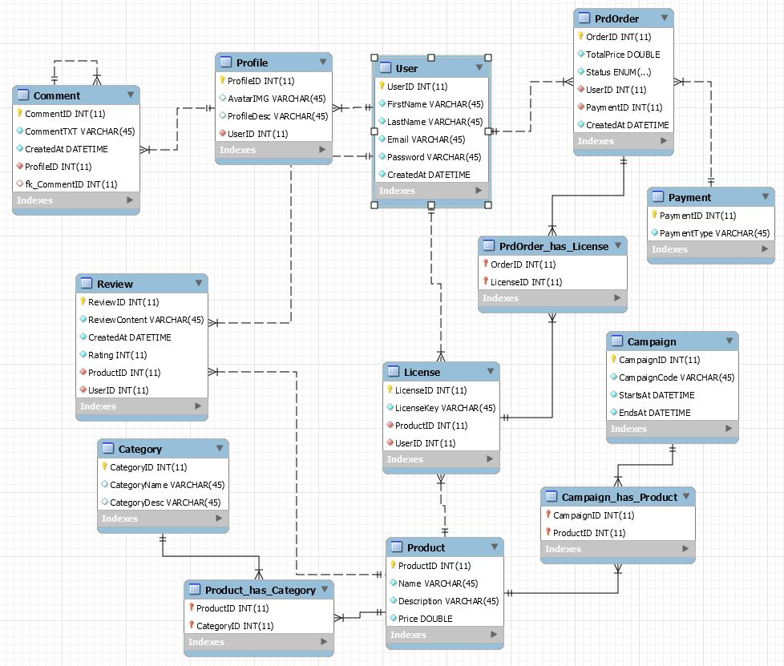

Loppuraportti - TTOS0300
========================

Gameplanet
----------

-   Leevi Kopakkala - K8292 \| K8292\@student.jamk.fi

-   Aku Lehtonen - K9264 \| <K9264@student.jamk.fi>

Arvosana ehdotukset:

-   Leevi Kopakkala 55/60

-   Aku Lehtonen 55/60

    Vaikka ratkaisu ei välttämättä ole täydellinen, pääsimme molemmat haastamaan
    itsemme ja kokeilemaan jotain täysin uutta.

Aloitus
-------

Aloitimme suunnittelun perinteisesti whiteboardilla, koska se tuntui
luntevimmalta, sekä nopeimmalta tavalta tehdä käsitemallinnusta ja löytää
oikeasti niitä asioita, mitä tietokannassa tarvitsemme.

Lähtökohtana oli luoda jonkinlainen kauppajärjestelmä (alunperin idea lähti
siitä pitsa paikasta), eli paikka jossa voisi myydä jotain tuotetta. Mutta
ajattelimme, että suurinosa loisi tällaisen ratkaisun, halusimme luoda jotain
täysin uutta.

Eli kyseessä on pelikauppa, jossa fyysisten esineiden sijaan myisimme lisenssejä
peleihin, joihin käyttäjät voisivat ostaa oikeudet pelata. (Eli pelin sijaan ei
omistaisi itse peliä vaan oikeuden pelata peliä)

Harva pelikauppa nykyisin on täysin pelkkä pelikauppa, joten loimme yhteisö
ominaisuuksia sen ympärille. Eli mahdollisuuden luoda profiileja, kommunikoida
toisten kanssa yms.

Yhteenveto projektista:
-----------------------

Teimme käytännössä kaiken tasavertaisesti, jaoimme työtehtävä ja aloimme
työstämään projektia Githubissa.

Ongelmakohtia ei oikeastaan tullut, suunnittelimme alkuun todella huolellisesti
tietokannan rakenteen, joka loppujenlopuksi oikeasti oli toimiva ratkaisua ja
suuremmilta ongelmilta vältyttiin.

Eli juuri tuo mitä me taululla piirtelimme oikeasti oli todella lähellä
lopputulosta.  
Siinä pääsimme keskustelemaan ratkaisusta, tekemään nopeita muutoksia ja pala
palalta rakentamaan lopputulosta.

Alkuvaiheessa kun suunnittelimme ja mietimme ratkaisun pitkälle, työntekeminen
oli todella tehokasta kun ei todellakaan tullut juuri minkäänlaisia ongelmia

Kun suunnitelma oli valmis, sekä olimme kirjoittaneet Githubiin työnjakoon ja
itse suunnitelmaan liittyvät dokumenit, meillä oli todella helppo lähteä luomaan
tietokantaratkaisua yhdessä Workbenchillä, jossa saimme nähdä mitä saatamme
tarvita, sekä koko tietokannan rakenne tuli selkeämmäksi.

Mutta kuten näkyy, lopullinen ratkaisu on todella lähellä sitä alkuperäistä
suunnitelmaa.

Ja vaikka tietokannassa on suhteellisen monimutkainen rakenne, tiesimme
tarkalleen miten sen pitäisi toimia ja lopputulos: Se toimi kuten ajattelimme!

Tässä testasimme omia kykyjämme, sekä parityö taitoja. Loimme ratkaisun, jota ei
lähelläkään ole harjoitustehtävissä tai osaamistesteissä tullut vastaan.

Käyttöliittymä:
---------------

## Sovellus: 

1. Asennus

mitä asioita tehtävä ja huomioitava asennuksessa
käytetyt=tarvittavat .NET Frameworkin ulkopuoliset kirjastot tai kilkkeet
konfiguroitavat asiat

2. Tietoa ohjelmasta (mitä tekee, miksi etc)

listaa toteutetut toiminnalliset vaatimukset
listaa toteuttamatta jääneet toiminnalliset vaatimukset
listaa toiminnallisuus joka toteuttiin ohi/yli alkuperäisten vaatimusten
listaa ei-toiminnalliset vaatimukset sekä mahdolliset reunaehdot/rajoitukset

3. Kuvaruutukaappaukset tärkeimmistä käyttöliittymistä + lyhyet käyttöohjeet jollei "ilmiselvää"

4. Ohjelman tarvitsemat /mukana tulevat tiedostot/tietokannat

kuvaukset tietokannoista ml. tietokanta-kaavio
laita tarvittaessa mukaan tietokannan luontiskriptit ja testidatan lisäysskriptit
Huomioitavaa käytössä

5. Tiedossa olevat ongelmat ja bugit sekä jatkokehitysideat

6. Mitä opittu, mitkä olivat suurimmat haasteet, mitä kannattaisi tutkia/opiskella lisää jne

7. Tekijät, vastuiden ja työmäärän jakautuminen

8. Tekijöiden ehdotus arvosanaksi, ja perustelut sille

